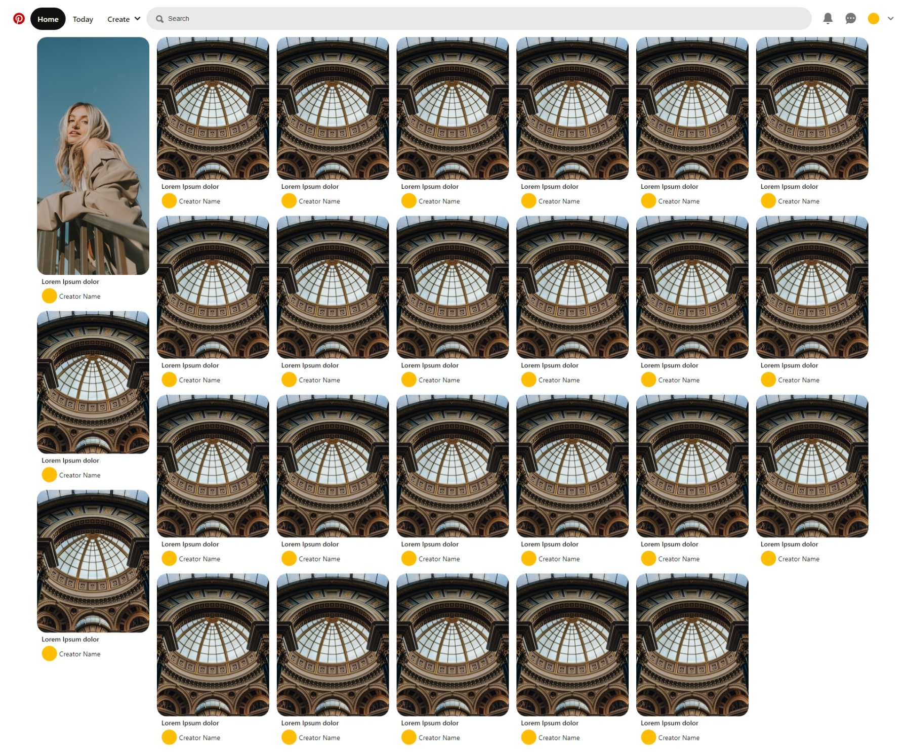

<h2 align="center"><a href="https://samuelcarvalho.dev/projetos/pinterest" align="center"> 🖥️  CHECK OUT: ONLINE SITE! -></a></h2>




<h1 align="center">
Pinterest Clone w React Js and Typescript</h1>


<br/>

<div align="center">
  <a href="#description">Description</a> &nbsp;&nbsp;&nbsp;|&nbsp;&nbsp;&nbsp <a href="#install">Install</a> &nbsp;&nbsp;&nbsp;|&nbsp;&nbsp;&nbsp <a href="#technologies">Technologies</a> &nbsp;&nbsp;&nbsp;|&nbsp;&nbsp;&nbsp <a href="#related">Related</a> &nbsp;&nbsp;&nbsp;|&nbsp;&nbsp;&nbsp <a href="#references">References</a> &nbsp;&nbsp;&nbsp;|&nbsp;&nbsp;&nbsp <a href="#contact">Contact</a>
</div>

<br />
<br />

<h3 id="description">✍️ Description:</h3>

<p>To me it is a difficult work to copy one of the sites I most use.More often than not, we as programmers, face a different grid alike this, that has its own columns style.To make this project, I use such a unknown css property. Hope you enjoy!</p>

<br />

<h3 id="install">🔍  Install:</h3>

<p>To create this project I have used React, but as long as I stated with npm, I think you are going to have problems to use with yarn.The best tip gave to you as a beginner is use npm or migrate to yarn, if all you want is just try - use npm:<p>

**To install the package:**

```npm install```


**To run correct script:**

```npm run start```


**If you want to create production build:**

```npm run build```

<br />

<h3 id="technologies">🚀  Technologies:</h3>

<p>To build this project is used:</p>

- React Js
- Next Js
- Typescript
- Styled Components
- Npm
- Node
- Redux ToolKit
- Eslint
- Prettier
- EditorConfig

<br />

<h3 id="related">♟️  Related:</h3>

See more:

<ul>
  <li><a href="https://github.com/samuelcarvalhodeveloper/Facebook-Clone-w-React-Js-Typescript-Styled-Components-Prettier-Eslint-EditorConfig">Facebook Clone</a></li>
  <li><a href="https://github.com/samuelcarvalhodeveloper/Google-Clone-w-React-Js-Typescript-Styled-Components-Prettier-Eslint-EditorConfig">Google Clone</a></li>
  <li><a href="https://github.com/samuelcarvalhodeveloper/Starbucks-Clone-w-React-Js-Typescript-Context-Api-Styled-Components-Prettier-Eslint-EditorConfig">Starbucks Clone</a></li>
  <li><a href="https://github.com/samuelcarvalhodeveloper/Calculator-w-React-Js-Redux-ToolKit-Typescript-Styled-Components-Prettier-Eslint-EditorConfig">Calculator w/ Redux</a></li>
  <li><a href="https://github.com/samuelcarvalhodeveloper/Pokemon-Pokedex-w-React-Js-Next-Js-Typescript-Server-Side-Rendering-Static-Site-Generation-Axios">Pokédex w Next Js</a></li>
</ul>

<br />

<h3 id="references">📖  References:</h3>

**React Js BoilerPlate:**

[ReactJs-TypeScript-Boilerplate-w-Styled-Components-and-React-Router-Dom-Prettier-Eslint-Configured](https://github.com/samuelcarvalhodeveloper/ReactJs-TypeScript-Boilerplate-w-Styled-Components-and-React-Router-Dom-Prettier-Eslint-Configured)

<br />

<h3 id="contact">✉️  Contact:</h3>

**Email:**
<a href="mailto:personal.samuelcarvalho@gmail.com">personal.samuelcarvalho@gmail.com</a>

<br />
<br />

<p align="center"><strong>Repository Link:</strong></p>

[https://github.com/samuelcarvalhodeveloper/Pinterest-Clone-w-React-Js-Typescript-Styled-Components-Prettier-Eslint-EditorConfig](https://github.com/samuelcarvalhodeveloper/Pinterest-Clone-w-React-Js-Typescript-Styled-Components-Prettier-Eslint-EditorConfig)
